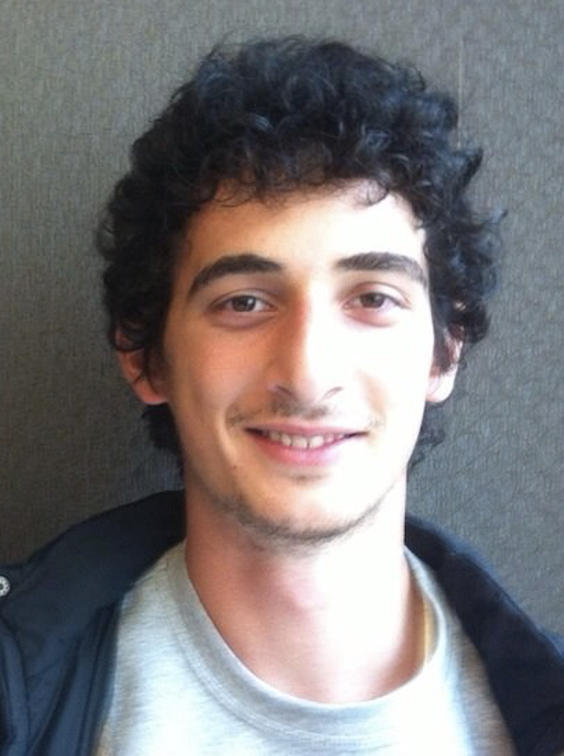

I am a first year Ph.D student in the
Department of Computer Science of University of Tokyo, in [Laboratory of Sequence Analysis](http://shibuyalab.hgc.jp/) under the supervision of Assoc. Prof. Tetsuo Shibuya.

I received my BS and Ms in [Computer Engineering](http://cmpe.boun.edu.tr/), where I focused on Natural Language Processing and Machine Learning.

[curriculum vitae ]({{ BASE_PATH }}/assets/AKDEMIR_CV_GOOGLE.pdf) 
[google scholar](https://scholar.google.com/citations?user=RfquIk4AAAAJ&hl=tr&oi=ao) 
[github](https://github.com/ardakdemir) 
[blog](https://ardakdemir.github.io)  

#### Publications

- Zhang, Yao-zhong, et al. "Nanopore base-calling from a perspective of instance segmentation." bioRxiv (2019): 694919. [link](https://www.biorxiv.org/content/biorxiv/early/2019/07/08/694919.full.pdf)
- Akdemir A., Güngör T. (2019) A Detailed Analysis and Improvement of Feature-Based Named Entity Recognition for Turkish. In: Salah A., Karpov A., Potapova R. (eds) Speech and Computer. SPECOM 2019. Lecture Notes in Computer Science, vol 11658. Springer, Cham [link](https://link.springer.com/chapter/10.1007/978-3-030-26061-3_2)
- Akdemir, Arda, et al. "Towards generalizable place name recognition systems: analysis and enhancement of NER systems on English News from India." Proceedings of the 12th Workshop on Geographic Information Retrieval. ACM, 2018. [link](https://dl.acm.org/citation.cfm?id=3281363)
- Akdemir, Arda, and Tunga Güngör. "Joint Learning of Named Entity Recognition and Dependency Parsing using Separate Datasets." [link](https://www.cmpe.boun.edu.tr/~gungort/papers/Joint%20Learning%20of%20Named%20Entity%20Recognition%20and%20Dependency%20Parsing%20using%20Separate%20Datasets.pdf)

#### Books

- Introduction to Markov Chains (in Turkish), Asst.Prof.Dr. Umit Islak,  M.Sc. Arda Akdemir - to be published in 2019

#### Conferences

- [21st SPECOM Conference](http://specom.nw.ru/), Turkey 2019 - Long Oral Presentation 
- [27th ISMB/ECCB Conference](https://www.iscb.org/ismbeccb2019), Switzerland 2019 - Poster Presentation
- [20th CICLing Conference](https://www.cicling.org/2019/), France 2019 - Poster Presentation
- [12th Workshop on Geographic Information Retrieval GIR'18](http://www.geo.uzh.ch/~rsp/gir18/program.html) at ACM SIGSPATIAL 2018 - Long Oral Presentation
- [Istanbul Mathematical Sciences Center, Probability Days](https://sites.google.com/site/umitislak/imbmprobdays2018) Conference 2018 - Oral Presentation
- BYOYO Workshop, 2018 - Volunteer
- [ProtestNews Lab in CLEF 2019](https://emw.ku.edu.tr/clef-protestnews-2019/) - Organizing Committee Member

#### Honors & Awards

- ***Best Graduation Project Award*** in Computer Engineering  Project Title : Adaptive Tuning of Chess Evaluation Function by Using Genetic Algorithms. [link](https://www.cmpe.boun.edu.tr/content/adaptive-tuning-chess-evaluation-function-using-genetic-algorithms)
- ***First Prize*** in Upper Level Japanese Speech Contest organized by Japanese Embassy in 2018 日本語弁論大会優勝者
- ***MEXT Scholarship Recipient*** University of Tokyo - 1 of 10 recipients from Turkey (2018 - )
- ***JASSO Scholarship Recipient*** Osaka University (2015-2016)

#### Languages

- Japanese: Advanced (N1 141/180)
- English: Advanced (Toefl 113/120)
- Turkish: Native

---

<h4>contact</h4>

    

        

            Arda Akdemir 
            <a href="https://www.is.s.u-tokyo.ac.jp/english/">Department of Computer Science, Graduate School of IST </a> 
            <a href="https://www.u-tokyo.ac.jp/ja/index.html">University of Tokyo</a> 
            <a href="http://hgc.jp/english/">Human Genome Center</a> 
            4-6-1, Shirokanedai, Minato-ku  
             Tokyo 108-8639 
            JAPAN  

            

            Email: <code>a</code><b>I</b><code>akdemir</code><b>don't</b><code>@</code><b>want</b><code></code><b>spam!
            </b><code></code><b>So</b><code></code><b>please</b><code>hgc</code><b>leave
            </b><code></code><b>me</b><code>.</code><b>alone</b><code>j</code><b>!</b><code>p</code> 
            Phone: +81 070-4490-2898
            

        

        

        
        

    

