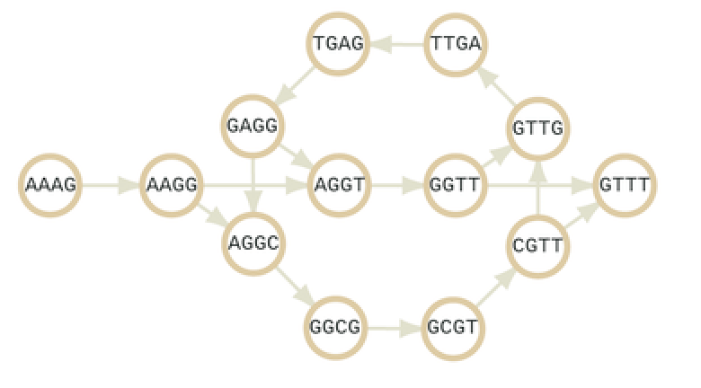
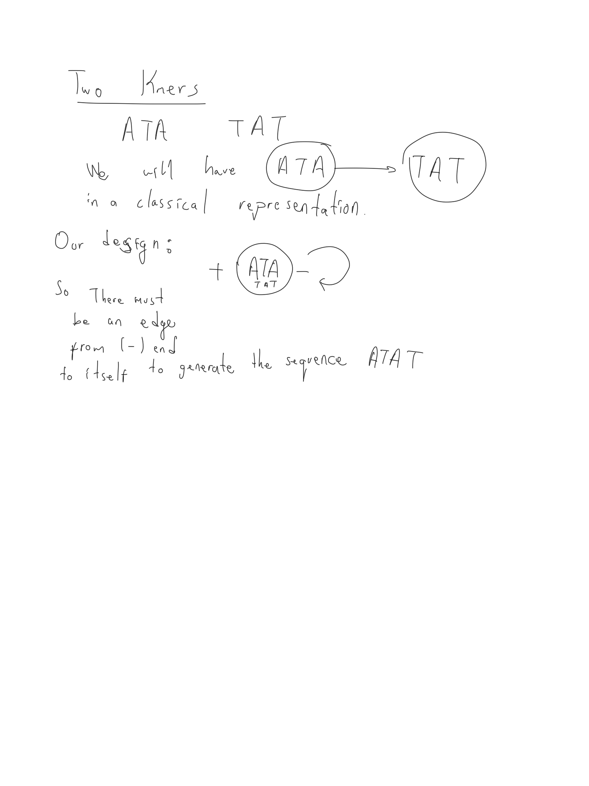

## De-Bruijn Graph Constructor Package for De-novo Genome Assembly

Mentor : [Ben J. Ward](http://www.earlham.ac.uk/ben-ward)

Relevant Google Summer of Code 2019 [webpage](https://summerofcode.withgoogle.com/projects/#5248824832950272)


### Project Abstract

De-novo sequence assembly is the process of constructing a contiguous long sequence out of shorter sub-sequences produced by sequencing platforms, without referring to a reference genome. It is an essential task in many biological studies today, including population and medical studies. The initial stages of de-novo assembly require the construction of a de-bruijn graph (DBG) from sequencing reads, the compression of a de-bruijn graph into a unitig graph, and the compression of multiple unitigs and nodes into contigs, supported by evidence from mapping paired-end reads. A coherent ecosystem of computational tools and packages allow researchers to quickly implement and test their ideas. For bioinformatics, Julia already offers such an ecosystem in the form of the BioJulia & EcoJulia projects, and additional independent packages. This project will add sequence assembly tools to the BioJulia ecosystem, specifically: 1) DBG construction from reads, 2) UG construction from a DBG and 3) Constructing contigs using unitigs. These tools will allow researchers to quickly construct and analyze the contigs obtained from a set of reads.


### Community Bonding Period (6 - 27 May)

I have started connecting with other GSoC students and exploring the open source community.
It is a fascinating experience to be in a developing team for the Julia language.
Going over the source code of the relevant package I already gained a deeper understanding of the underlying concepts
behind the Julia language. Even though I had previous experience coding in Julia, I realized that I never truly understood some key
concepts especially related to Types. I believe that through this GSoC project I will gain valuable insights about the fundamental concepts of  Julia programming language and programming languages in general.

My primary aim during this period is to get familiar with the relevant packages and get a head start to the project if it is posssible.
I am spending most of my time reading the source code, looking at issue related to the packages (trying to fix them if possible) and applying what I have learnt to write some simple code.

Apart from my contributions to the BioSequenceGraph package, I am also storing my experiments with using the BioSequences package in a separate jupyter notebook. This notebook can be thought of as a coding  diary. As I go through the source code and add new functionalities I test them and create example codes. I believe at the end  of the  project this notebook will also be useful for users who would like to see some working examples. It can be considered as an extended cheat sheet for BioSequences package which  to the best of my knowledge does not exist online.

I started contributing to the package two weeks before  the end of the community bonding period. I started by adding some simple functionalities and going over some bugs (or concepts which I thought are bugs but turned out not to be :)).
Initial commits to the BioSequenceGraph repository:

- Fixed several minor bugs in BioSequences repository.

- Added the subsequencing functionality to BioSequence types. This functionality allows querying a dna sequences with a vector:

```
dna_1 = dna"ATGC"
dna_1[[1,3]]
```


- Random Kmer generator is implemented. This functionality is mainly useful for speeding up the testing of the code.
Similar functions are already available in BioSequences package in the randseq.jl file.

- Added several functionalities which will form the basis of constructing De Bruijn Graphs from SequenceGraphNodes.

- Initialized the DeBruijnGraph type and started writing the core functionalities.


#### Weekly meetings with Mentor

We are constantly in communication with my mentor Dr. Ben J. Ward through emails and issues on GitHub.
Apart from that, we are making weekly meetings where we discuss about how to proceed and I go over the work I have done.
These meetings are important for me especially at the initial phases of the project as they help me a lot to understand basic concepts of the BioSequence packages  and all the underlying design concepts. Also it is a valuable time for me to ask my questions.


#### DeBruijnGraph


Before waiting for the end of community bonding period we have started implementing the DeBruijnGraph package along with some functionalities.

In our formalization of the DeBruijnGraph we represent each dna sequence (of arbitrary length) as a Node on the Graph. There exists a Link between two Nodes which represent the overlaps between nodes/sequences. Each Node is of type SequenceGraphNode and each Link is of type SequenceGraphLink. These types have their special constructors and functionalities. Below is an example of a DeBruijnGraph where sequences are represented as nodes.

<a href="../pages/publpics/debru3.png">
    </a>

DeBruijnGraph is a special type of SequenceGraph with its own constraints ( e.g. links between arbitrary nodes are not allowed).
It is made up of two fields:

- A vector of Nodes Vector

- A vector of vector of Links

```

struct DeBruijnGraph
    nodes::Vector{SequenceGraphNode}
    links::Vector{Vector{SequenceGraphLink}}
end

```

Implemented Functionalities:

**DeBruijnGraph Constructor:**

At the beginning, we have designed a constructor to represent a static DeBruijnGraph where we assume no operation such as node merging will later be performed. This constructor receives as input a list of kmers of type Kmer{T,K} where T denotes the NucleicAcidType (DNA or RNA) and K denotes the length k. Using these kmers the constructor checks for overlaps of length $k-1$ and creates directed Links from source to destination. Source is the node which has the overlap as a suffix and destination is the node which has the overlap as a prefix.


**Query Functions:**

Before moving into the next milestone which is to build a Unitig Graph (UG) from the kmers in the DeBruijn Graph, we will implement some more core functionalities to ease implementation of the more complicated stages of the package. Some of these core functionalities are query functions which are necessary for finding paths on dbg suitable for merging. Below is the list of these queries:

- count_indegree : counts the number of incoming edges to a vertex
- count_outdegree : counts the number of outgoing edges from a vertex
- is_a_path  : given a sequence of nucleotides checks whether a path exists that yields the given sequences
- is_in_node : this function will be useful for detecting substrings of a node label which will be useful during path checking as explained below.

These query functions will be useful during UG construction.

For now the counters are calculated assuming that we have a typical dbg as a directed graph. So for each node we look at the source and sink ends to count indegree and outdegree respectively.

**is_a_path** : If we formulate the dbg as static in that we initialize it with some kmers and do not update it, this query is trivial to implement. We can exhaustively check all the nodes that have the first k letters of the path as its label and move down on its children. Since we do not have multiple nodes for the same kmer this can take at most O(\|V\|^2) or O(\|V\|  x \|E\| ) even if we implement the query naively. However, if we allow edge collapsing/vertex merging, a more involved solution is necessary to handle all possible graphs. Imagine the following intermediate representation that occurs after merging two 3mers "ATG" and "TGT":


If we check all the edges and look for an exact match than the algorithm will return a false negative in the cases where we search for a sequence that starts with "TGT". For this reason we implement the node_search as a query over the substrings of the label of a node rather than an exact match.

### Official Coding Period (28 May -)

We have already implemented the core functionalities and defined a basic de Bruijn Graph type for BioJulia during the community bonding period.


After our  discussions with Dr. Ben Ward we decided to revise the constructor function for the dbg. The new design represents each kmer and its reverse complement using the same node and uses (+) and (-) end of a node for labeling edges between nodes.

Below is the  pseudocode for the  new  constructor :  

```
Make an empty graph

Make two empty Vector{Tuple{DNAKmer{K-1}, Int64}}. Call one `kmer_ovl_bw_nodes`, call the other one `kmer_ovl_fw_nodes`.

For each kmer in kmerset...
    Make the canonical form of the kmer. (there should be a canonical method in BioSequences).
    Add the canonical kmer to the nodes of the graph, and note it's ID.
    Take the prefix (k-1) of the canonical kmer.
    If the prefix is canonical, push the tuple (canonical(prefix), +nodeid) to `kmer_ovl_fw_nodes`.
    Else push the tuple(canonical(prefix), +nodeid) to the `kmer_ovl_bw_nodes`.
    Take the suffix (k-1) of the canonical kmer.
    If the suffix is canonical, push the tuple (canonical(suffix), -nodeid) to `kmer_ovl_bw_nodes`.
    Else push the tuple (canonical(suffix), - nodeid) to `kmer_ovl_fw_nodes`.
end

Sort `kmer_ovl_fw_nodes`.
Sort `kmer_ovl_bw_nodes`.

for kbn in kmerovl_bw_nodes
        for kfn in kmerovl_fw_nodes
            if first(kbn) == first(kfn)
                add link to graph with source=last(kbn), destination=last(kfn) and distance=-k+1
            end
        end
end

Return the graph.
```

This constructor returns  a dbg which also consists of two vectors.  Yet the  main difference is that we only represent the kmers  in their canonical form and represent each kmer and its reverse complement with the  same node, both decreases the memory footprint of  the graph. Canonical form of  a kmer  is the lexicographically lesser  one of a  kmer  and  its reverse complement.

Example:

```
julia> kmer  = Kmer{DNA,4}("ACTT")
DNA 4-mer:
ACTT

julia> canonical(kmer)
DNA 4-mer:
AAGT

julia> kmer  == canonical(kmer)
false
```

kmer ACTT is not in the canonical form as the reverse complement AAGT is lexicographically  smaller. Thus both kmers ACTT, and AAGT is represented   using only a single node as (+) AAGT (-). The plus  end  denotes the prefix in canonical form and also denotes suffix in the non-canonical form.


We have finalized the implementation of the  new constructor and did some  initial tests. For random 5 3mer listed  below:


```
5-element Array{Kmer{DNA,3},1}:
 AAC
 TCA
 GAG
 AAT
 GCG
```

The constructor generates the following dbg :

```

DeBruijnGraph(SequenceGraphNode[SequenceGraphNode{Kmer{DNA,3}}(AAC, true), SequenceGraphNode{Kmer{DNA,3}}(TCA, true), SequenceGraphNode{Kmer{DNA,3}}(CTC, true), SequenceGraphNode{Kmer{DNA,3}}(AAT, true), SequenceGraphNode{Kmer{DNA,3}}(CGC, true)], Array{SequenceGraphLink,1}[[], [SequenceGraphLink(2, -3, -2)], [], [], [], []], 3)
```

which consists of 5 nodes with labels AAC, TCA, CTC, AAT and CGC. As one  can see 3mers GAG and GCG are replaced with their canonical  forms in the  new graph.


Next step in our schedule is to revise the  is_a_path and other related dbg functionalities  to be  compatible with the new constructor.
Then, we are planning to implement some functions for detecting the simple paths in a dbg. is_simple_path function is already initialized for the DeBruijnGraph type.

Below is an example of a case where we need to consider during addition of the edges. If the suffix/prefix are equivalent to their reverse_complement both directions  should be taken  into account otherwise some paths will be missing in the dbg.s

<a href="../pages/publpics/GSOC.png">
    </a>


Our plan is to combine the nodes on a simple path to create unitigs from kmers. This will increase the nucleotide length of some nodes.
A simple path is defined as a series of nodes where the internal nodes have incoming and outgoing degrees of one and the start node and the end node have incoming and outgoing degrees >1 respectively. Thus merging the nodes in this path does not create ambiguity.


#### Combining Simple paths

Next step in our milestone is to collapse the nodes and merge all the intermediate  edges.
However  this step requires special care as our current design traverses the links  and edges by their node_id.
The vector structure  should be  converted to either a  hash table or we must make updates to the all elements of the  nodes  and links vectors  which is  very costly.

That is why I decided to change the design of the dbg. Previously we represented nodes and links as vectors  but now they will be  represented as dictionaries. This way we  do not have to update the index information. Dictionary data structure allows us to cleanly access each node and link after unitiging.


Once we update the design of the dbg, merging nodes on a simple path is straightforward. Without loss of generality, we assume that the first node on the maximal simple path is the only remaining node and the rest of the nodes are collapsed into it. So the start node will be the only remaining node at the end. The outgoing edges of the final node (if any) will be the outgoing edges of this new collapsed edge. The k value used during construction is important to be able to traverse neighbors correctly since the length of the sequence gets longer after the merge operation but the overlap is still k-1.


We have finalized the merging functionality which is implemented as a function named merge_simple_paths.

```

function merge_simple_paths(dbg,simple_paths;alp=DNAAlphabet{4})

```


#### Error Detection and Simplifying the deBruijn_Graph

Initial and the most basic step of simplifying the dbg is to convert the initial dbg into UG.
Next step before generating the contigs is to further simplify the UG.

- Trimming dead-end tips : We remove all tips with no outgoing edge. Tip refers to an edge from a node (with multiple outgoing edges), where the destination of the edge has no outgoing edges. These nodes are treated as errors that occur at the end of a read.

- Popping bubbles : Two path that diverge from a single node and then merge into another node. In such a case one of the paths are removed from the graph. Usually the removed path has a low coverage (depth) and treated as an error that occurred in the middle of a read.

- Removing chimeric edges : Edges that cross across two simple paths. Such edges usually have low coverage and removed from the graph.


***delete_tips*** : This is the first step in error correction. We delete each tip that has no outgoing edge as we simply treat them as errors.
In addition, we require that at least one outgoing edge of the source of the incoming edge to this tip has a destination which is not a dead-end. First we find all the candidate dead-end tips. Then by checking their parent nodes we decide whether to remove them or not.

Example. Initially we have the following nodes :

```
Dict{Int64,SequenceGraphNode} with 6 entries:
  7 => SequenceGraphNode{Kmer{DNA,4}}(ATGC, true)
  4 => SequenceGraphNode{Kmer{DNA,4}}(CGTC, true)
  2 => SequenceGraphNode{Kmer{DNA,4}}(AATG, true)
  5 => SequenceGraphNode{Kmer{DNA,4}}(CGTA, true)
  8 => SequenceGraphNode{BioSequence{DNAAlphabet{4}}}(ACGAAT, true)
  1 => SequenceGraphNode{Kmer{DNA,4}}(AATC, true)
```
```
  delete_tips(dbg2)
```

```
Candidates
[7, 1]
To be removed
[1]
```
```
nodes(dbg2)
```
```
Dict{Int64,SequenceGraphNode} with 5 entries:
  7 => SequenceGraphNode{Kmer{DNA,4}}(ATGC, true)
  4 => SequenceGraphNode{Kmer{DNA,4}}(CGTC, true)
  2 => SequenceGraphNode{Kmer{DNA,4}}(AATG, true)
  5 => SequenceGraphNode{Kmer{DNA,4}}(CGTA, true)
  8 => SequenceGraphNode{BioSequence{DNAAlphabet{4}}}(ACGAAT, true)
```


#### Neighbor Queries

Next we would like to be able make some queries about the successors and predecessors of a given kmer or any sequence.
These queries are important when we would like to represent a genome as a dbg.


Here I take some notes about the design principles of the BioSequences about kmers.

A nucleotide with bitvalue B has kmer-bitvalue kmerbits[B+1]. Ambiguous nucleotides have no kmervalue, here set to 0xff.


```
const kmerbits = (0xff, 0x00, 0x01, 0xff,
                  0x02, 0xff, 0xff, 0xff,
                  0x03, 0xff, 0xff, 0xff,
                  0xff, 0xff, 0xff, 0xff)
```

The internal representation for a biological sequence including kmers is an unsigned integer of 64 bits (UInt64).
Each nucleotide can be represented using two bits.
Conversion between a nucleotide and its bit representation is done by calling the reinterpret function:

```
reinterpret(Int8,nt)
```
where nt is the nucleotide.


For iterating over the kmers of a sequence we have two available functions at the moment.
One attempts to make a Biosequence=>Kmer conversion for each substring of a given sequence (extract_canonical_kmers) and the other uses the EveryKmerIterator type to go over the kmers of a sequence.
First method is intuitive but expensive.

To get all the kmers of a sequence we call the iterate function with different states.
More specifically since we would like to get all consecutive kmers we increase the start pos by 1.

### Design Switch to Sequence Distance Graphs (SDG)

Following the suggestions of my mentor Ben Ward, we switched to a new design to represent the DeBruijnGraph using a more general type 'SequenceDistanceGraph'. This new design is also very similar to the DBG type. Main difference of this type is that it allows direct construction of UG from kmers. Prevously we used a DeBruijn constructor which straightforwardly constructed a graph using the kmers.
The constructor for SDG directly collapses the simple paths to construct the UG. The constructor can be called with calling SequenceDistanceGraph initializer with a list of kmers.

```
SequenceDistanceGraph(kmerlist::Vector{DNAKmer{K}}) where {K} = new_graph_from_kmerlist(kmerlist)
```

```
kmerlist = Vector{DNAKmer{3}}([DNAKmer{3}("AAT"),DNAKmer{3}("ACT")])
SequenceDistanceGraph(kmerlist)
```

I have made several edits to the initial constructor to support constructing the graph from unsorted kmers that are not necessarily canonical. In its final form the function for graph construction is as follows:

```
function new_graph_from_kmerlist(kmerlist::Vector{DNAKmer{K}}) where {K}
    str = string("onstructing Sequence Distance Graph from ", length(kmerlist), ' ', K, "-mers")
    @info string('C', str)
    sg = GRAPH_TYPE()
    kmerlist = get_canonical_kmerlist!(kmerlist)
    sort!(kmerlist)
    build_unitigs_from_kmerlist!(sg, kmerlist)
    if n_nodes(sg) > 1
        connect_unitigs_by_overlaps!(sg, DNAKmer{K})
    end
    @info string("Done c", str)
    return sg
end
```

Sorted is done to allow fast search for backward and forward neighbors. This reduces the expected running time of the construction step substantially.

Assuming that we have N nodes and each can have 4 forward and 4 backward neighbors (constant in size), a naive method for checking all nodes (kmers) for membership would have $O(N)$ time for each kmer. By sorting, we have an $O(NlogN)$ preprocessing time and each membership query takes only $O(logN)$ time. Thus the expected time for neighbor search goes down from $O(N^2)$ to $O(NlogN)$.


## Final Evaluation Period

We continued the work on graph simplification. There are several heuristical approaches commonly used in the literature.
After doing a literature review we focused on two methodologies for removing bubbles on DBG.
First method is used by Velvet which finds all bubbles by using the TourBus Algorithm, which is costly, and removes all the low coverage ones.

Bubble is defined as two simple paths that start and end at same nodes with high similarity score.
<p align="center">

</p>


The figure above shows bubble made up of two simple paths spelling "AATCTTA" and "AATGTTA". For illustrative purposes we assume that the coverage information is the same for each interior node of the simple paths and it is denoted next to each path as 30x and 3x. The algorithm first checks the similarity between two sequences. If the similarity is above a certain threshold (0.8 identity rate by default) we delete the path with low coverage. So for this example the bubble will be simplified into the figure below.


<p align="center">

</p>


In our formalization we take the approach used by [Arapan](https://www.ncbi.nlm.nih.gov/pmc/articles/PMC3441218/) and first collapse all simple paths and then pop the bubbles. This approach does not make use of the computationally expensive TourBus Algorithm which is required if we directly try to find the bubbles on the DeBruijn Graph constructed using the initial kmer list.


<p align="center">

</p>


Following the methodology of Arapan, we repeat path collapsing and bubble popping until no changes are made to the graph.
Popping bubbles creates new simple paths and by repeating these two steps we can pop not only the simple bubbles as shown previously, but also nested bubbles.

A complex bubble looks like the figure below. We need to first simplify the graph  by popping the bubble formed above and only then we can remove the larger bubble formed at the bottom part of the figure.

<p align="center">

</p>


Then we move on to deleting tips. Then we repeat the whole process until no further simplification is made on the graph.
This is because, after removing bubbles and collapsing simple paths, new tips may emerge and vice versa.


### Tip deletion


Next step is to delete nodes that have tips with either low coverage or shorter length.
For now we are making use of the coverage information to delete all the low coverage tips on the graph!!


Builder from fastq file with error correction flag :

```
SequenceDistanceGraph(fastq_file_name::String,read_num::Int64,K::Int64,error::Bool)= graph_from_fastq(fastq_file_name, read_num,K,error)
```
Call the builder with :

```
SequenceDistanceGraph("pe-reads.fastq",2,11,true)

```


We again start with two reads and extract all 11-mers from : "CACACTCCTGATTTAAATAC" , "CACACTCCAGATTTAAATAC". We obtain 3 contigs after collapsing the simple paths :

```
SequenceDistanceGraph{BioSequence{DNAAlphabet{2}}}(SDGNode{BioSequence{DNAAlphabet{2}}}[SDGNode{BioSequence{DNAAlphabet{2}}}(CACACTCCAGATTTAAATA, false), SDGNode{BioSequence{DNAAlphabet{2}}}(CACACTCCTGATTTAAATA, false), SDGNode{BioSequence{DNAAlphabet{2}}}(GATTTAAATAC, false)], Array{DistanceGraphLink,1}[[DistanceGraphLink(-1, 3, -10)], [DistanceGraphLink(-2, 3, -10)], [DistanceGraphLink(3, -2, -10), DistanceGraphLink(3, -1, -10)]])
```

CACACTCCAGATTTAAATA and CACACTCCTGATTTAAATA point to the same node with sequence : GATTTAAATAC. We remove the sequence with low coverage to obtain an intermediate graph:

```

 After tip removal, SequenceDistanceGraph{BioSequence{DNAAlphabet{2}}}(SDGNode{BioSequence{DNAAlphabet{2}}}[SDGNode{BioSequence{DNAAlphabet{2}}}(CACACTCCAGATTTAAATA, false), SDGNode{BioSequence{DNAAlphabet{2}}}(< EMPTY SEQUENCE >, true), SDGNode{BioSequence{DNAAlphabet{2}}}(GATTTAAATAC, false)], Array{DistanceGraphLink,1}[[], [], []])

```


Then graph building and bubble popping is run again to construct the final version of the graph :


```
SequenceDistanceGraph{BioSequence{DNAAlphabet{2}}}(SDGNode{BioSequence{DNAAlphabet{2}}}[SDGNode{BioSequence{DNAAlphabet{2}}}(CACACTCCAGATTTAAATAC, false)], Array{DistanceGraphLink,1}[[]])

```

### Graph Building after unitig construction

The initial graph constructor uses the overlaps between kmers directly to find the unitigs. When we find the overlaps between nodes with sequences longer than the initial K  value, we can not make use of the same constructor as we must take into account.

The main reason is that we store a sequence and its reverse complement in a single node. Yet if we naively look at the k-overlaps without taking into account the direction we may find overlaps that are not necessarily correct.
Below is an example case for K=3 (which requires an overlap of length 2 between kmers).

***Wrong alignment example.***

<p align="center">

</p>

The node on the left contains a 3mer ACT as the prefix of node's reverse complement. The kmer neighbors of the prefix of the node on the right are : ["ACT","CCT","GCT",TCT]. If we naively check the k-1 overlaps between suffixes and prefixes of length k without taking into account the directions we add a wrong edge to the graph.

To prevent this issue during overlap finding I define candidates separately for forward and backward neighbors and check them separately.

***Definition.*** Forward candidate is either a k-long prefix of a node's sequence or k-long suffix of the same sequence's reverse complement.

***Definition.*** Backward candidate is either a k-long suffix of a node's sequence or k-long prefix of the same sequence's reverse complement.

By using two lists for forward and backward neighbors we solve the direction issue for finding the overlaps of length k-1 between sequences of length $$\geq$$ k.
